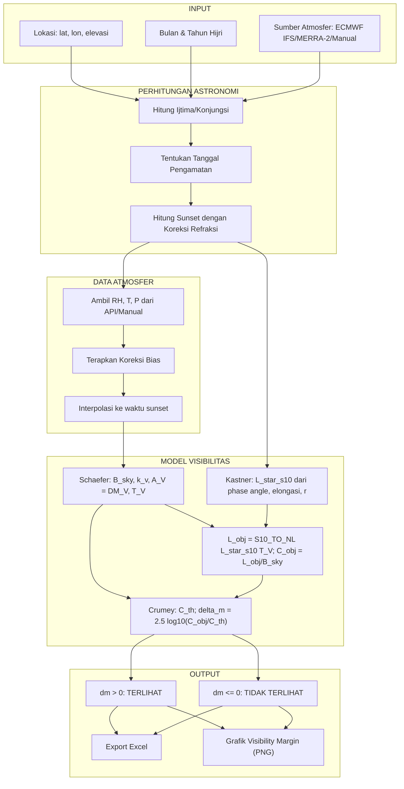

# Perhitungan Visibilitas Hilal

## Kombinasi Model Schaefer, Kastner, dan Crumey Berbasis Input Meteorologi


## Mulai menjalankan program

Buka terminal di **folder proyek** yang berisi `scripts/`, `src/`, dan
`.venv/`. Anda tetap dapat menjalankan file Python langsung seperti dulu.

Untuk lokasi tunggal maupun multi-lokasi yang Anda pilih sendiri:

```powershell
.\.venv\Scripts\python.exe .\scripts\run_visibility.py
```

- Pilih `1` pada menu awal untuk **lokasi tunggal**.
- Pilih `2` pada menu awal untuk **multi-lokasi**; berikutnya pilih semua
  82 lokasi atau masukkan beberapa nomor, misalnya `1,2`.

Untuk menjalankan seluruh **278 kasus dataset observasi penelitian**:

```powershell
.\.venv\Scripts\python.exe .\scripts\run_batch.py
```

| File yang dahulu dijalankan | Peluncur sekarang |
| --- | --- |
| `core_crescent_visibility.py` | `scripts/run_visibility.py` |
| `core_multi_location.py` | `scripts/run_batch.py` |

File hasil yang disimpan berada di `outputs/`. Baseline F mata telanjang dan teleskop adalah
**2.0**. Baca [panduan langkah demi langkah](docs/RUNNING.md) untuk contoh
isian menu, perbedaan batch, dan instalasi pertama.

---

## 1. Pendahuluan

Program ini menghitung visibilitas hilal dengan mengintegrasikan:

- **Model Schaefer** untuk background langit, koefisien ekstingsi, kehilangan cahaya sepanjang garis pandang, dan transmisi atmosfer
- **Model Kastner** untuk luminansi intrinsik hilal, lalu penerapan transmisi Schaefer
- **Model Crumey** untuk ambang kontras dan margin visibilitas mata telanjang serta teleskop
- **Data Atmosfer** dari arsip ECMWF IFS, MERRA-2, atau input manual

---

## 2. Kebaruan Penelitian

### Perbandingan dengan Penelitian Sebelumnya

| Aspek                             | Penelitian Sebelumnya                              | Program Ini                                                              |
| --------------------------------- | -------------------------------------------------- | ------------------------------------------------------------------------ |
| **Sky Brightness**          | Diperoleh dari website (algoritma tidak diketahui) | Dihitung menggunakan **model Schaefer** dengan algoritma transparan |
| **Koefisien Ekstingsi (k)** | Menggunakan nilai asumsi (misal k=0.5)             | Parameterisasi Schaefer memakai RH, T, elevasi, lokasi dan waktu; tekanan digunakan untuk refraksi |
| **Luminansi Hilal**         | Model Kastner dengan k asumsi                      | Luminansi intrinsik Kastner dikalikan **transmisi LOS Schaefer**    |
| **Data Atmosfer**           | Tidak ada / asumsi standar                         | Data **arsip ECMWF IFS dan reanalisis MERRA-2** dengan interpolasi temporal    |
| **Visibilitas Teleskop**    | Koreksi sederhana (Schaefer 1990)                  | Model terintegrasi **Schaefer-Crumey** dengan contrast threshold    |

### Kontribusi Utama

Parameterisasi ekstingsi Schaefer dievaluasi menggunakan input meteorologi yang bergantung pada waktu dan lokasi dari arsip ECMWF IFS HRES melalui Open-Meteo, reanalisis MERRA-2, atau input manual. Komponen aerosol, ozon, Rayleigh dan uap air tetap mengikuti asumsi model Schaefer; penggunaan arsip meteorologi tidak dengan sendirinya membuktikan akurasi ekstingsi lokal. Tekanan tidak masuk langsung ke koefisien ekstingsi pada implementasi ini, tetapi digunakan pada refraksi posisi. Produk `ecmwf_ifs` merupakan arsip IFS HRES dan berbeda dari reanalisis ERA5. [Dokumentasi sumber Open-Meteo](https://open-meteo.com/en/docs/historical-weather-api#data-sources).

### Rumus Ekstingsi yang Dihitung (Bukan Asumsi)

Program ini menghitung **4 komponen ekstingsi** secara terpisah:

```
K_total = K_R (Rayleigh) + K_A (Aerosol) + K_O (Ozon) + K_W (Uap Air)
```

| Komponen | Variabel yang Digunakan      | Rumus                                                  |
| -------- | ---------------------------- | ------------------------------------------------------ |
| $K_R$  | Elevasi (H), Wavelength (λ) | $0.1066 \cdot e^{-H/8200} \cdot (\lambda/0.55)^{-4}$ |
| $K_A$  | **RH**, Elevasi, Musim | $\propto (1 - 0.32/\ln(RH/100))^{1.33}$              |
| $K_W$  | **RH, T**, Elevasi     | $\propto RH \cdot e^{T/15} \cdot e^{-H/8200}$        |
| $K_O$  | Lintang, Musim               | Variasi musiman lapisan ozon                           |

---

## 3. Requirements & Dependencies

### System Requirements
- **Python**: 3.10 atau lebih tinggi
- **OS**: Windows, Linux, atau macOS
- **Memory**: Minimal 4GB RAM (8GB direkomendasikan)
- **Storage**: ~50MB untuk ephemeris dan cache

### Python Packages

```bash
pip install -r requirements.txt
```

Atau install manual:

```bash
# Core dependencies
pip install numpy>=1.20.0
pip install pandas>=1.3.0
pip install openpyxl>=3.0.0

# Astronomical calculations
pip install skyfield>=1.45.0

# Weather API requests
pip install requests>=2.26.0
pip install openmeteo-requests>=1.1.0
pip install requests-cache>=1.0.0
pip install retry-requests>=2.0.0

# Timezone handling
pip install pytz>=2021.1

# Visualization
pip install matplotlib>=3.5.0
```

### Files Required
- `de440s.bsp` - JPL Ephemeris (sudah termasuk, ~32MB)

---

## 4. Installation

### Step 1: Clone/Download Repository
```bash
git clone https://github.com/addinsaputra/Theoretical_Model_for_Hilal_Visibility.git
cd Theoretical_Model_for_Hilal_Visibility
```

### Step 2: Install Project
```powershell
python -m venv .venv
.\.venv\Scripts\python.exe -m pip install -e .
```

### Step 3: Run Program
```powershell
.\.venv\Scripts\python.exe .\scripts\run_visibility.py
```

Instalasi editable memakai kode dan data pada checkout ini. Hasil default
ditulis ke `outputs/`; data ephemeris berada di `data/ephemeris/`.
Menu awal `1` = lokasi tunggal, `2` = multi-lokasi. Lihat
[panduan menjalankan](docs/RUNNING.md) untuk langkah lengkap. Instalasi
cukup dilakukan saat menyiapkan lingkungan; penggunaan berikutnya langsung
menjalankan file peluncur.

---

## 5. Struktur Program

```text
src/hilal_visibility/
  calculator.py          # API dan alur perhitungan
  cli.py                 # Input interaktif
  batch.py               # Workflow perbandingan observasi
  ephemeris.py            # Astronomi Skyfield/DE440s
  models/                # Schaefer, Kastner, Crumey, optik dan luas sabit
  atmosphere/            # IFS, MERRA-2 dan provenance
  reports/               # Ekspor Excel dan grafik gabungan
  studies/               # Diagnostik dan studi sensitivitas
scripts/                 # Peluncur, pemeriksaan referensi, contoh Excel
data/                    # Ephemeris, 82 lokasi, 278 observasi CCD
docs/reviews/            # Saran perubahan dan audit historis
tests/                   # Regresi model dan tata letak paket
validation/              # Artefak penelitian historis
outputs/                 # Hasil perhitungan dan studi baru, diabaikan Git
```

Lihat [panduan struktur dan pemetaan modul lama](docs/PROJECT_STRUCTURE.md)
serta [daftar peluncur](scripts/README.md). Baseline residual F mata telanjang
dan teleskop tetap sama, 2.0.

---

## 6. Diagram Alur Algoritma



---

## 7. Model Schaefer (Sky Brightness)

### 7.1 Koefisien Ekstingsi

$$
K = K_R + K_A + K_O + K_W
$$

| Komponen           | Rumus                                                  | Pengaruh        |
| ------------------ | ------------------------------------------------------ | --------------- |
| $K_R$ (Rayleigh) | $0.1066 \cdot e^{-H/8200} \cdot (\lambda/0.55)^{-4}$ | Elevasi         |
| $K_A$ (Aerosol)  | $\propto (1 - 0.32/\ln(RH/100))^{1.33}$              | **RH**    |
| $K_W$ (Uap Air)  | $\propto RH \cdot e^{T/15}$                          | **RH, T** |
| $K_O$ (Ozon)     | Faktor musiman                                         | Lintang         |

### 7.2 Airmass

Rumus airmass internal Schaefer tetap dipakai. Bentuk berikut adalah airmass umum untuk background langit; ekstingsi sumber memakai total kehilangan cahaya dari komponen Schaefer:

$$
X = \frac{1}{\cos(z) + 0.025 \cdot e^{-11 \cdot \cos(z)}}
$$

$$
A_V = DM_V = K_R X_G + K_A X_A + K_O X_O + K_W X_G,
\qquad T_V = 10^{-0.4 A_V}.
$$

| Output | Makna | Satuan |
| --- | --- | --- |
| `k_v` | `K[2]`, koefisien ekstingsi V untuk diagnostik | mag/airmass |
| `extinction_mag_v` | `DM[2]`, kehilangan cahaya sepanjang garis pandang | mag |
| `transmission_v` | Transmisi atmosfer yang diterapkan sekali pada hilal | dimensionless |
| `sky_brightness` | Background langit di posisi hilal | nL |

`K` dan `DM` lengkap untuk kelima band tetap tersedia. Kastner menerima `transmission_v` secara eksplisit. Jika perhitungan Schaefer gagal, pipeline meneruskan error, tanpa mengganti ekstingsi LOS dengan koefisien asumsi.

### 7.3 Sky Brightness (nanoLambert)

$$
B_{sky} = B_N + \min(B_T, B_D)
$$

Untuk pipeline hilal, moonlight dikeluarkan karena Bulan adalah objek pengamatan. Implementasi menggunakan $B_{sky} = B_N + \min(B_T, B_D)$, dengan $B_D$ adalah daylight.

---

## 8. Model Kastner (Luminansi Hilal)

### 8.1 Magnitudo Visual Bulan

$$
m_v = 0.026 \cdot \alpha + 4 \times 10^{-9} \cdot \alpha^4 - 12.73
$$

Sudut fase `α` dihitung oleh fungsi native [`phase_angle(sun)` Skyfield](https://rhodesmill.org/skyfield/api-position.html#skyfield.positionlib.ICRF.phase_angle), melalui `moon_astrometric.phase_angle(ephem["Sun"]).degrees`. Posisi astrometrik berasal dari `observer.at(t).observe(ephem["Moon"])`, memakai DE440s dan koreksi waktu tempuh cahaya Bulan ke pengamat. Iluminasi memakai `moon_astrometric.fraction_illuminated(ephem["Sun"])`, sehingga konsisten dengan `k = (1 + cos α) / 2` pada model cakram bola. Sudut Matahari–Bulan–pengamat ini bernilai 0° untuk fase penuh dan 180° untuk fase gelap. API UTC/lokal tetap menghasilkan derajat; dot product manual sudah dihapus.

Definisi **fase astrometrik native Skyfield** belum identik dengan “true PHASE ANGLE” [Horizons quantity 43](https://ssd.jpl.nasa.gov/horizons/manual.html#observer-table). Implementasi Skyfield 1.55 mengevaluasi posisi Matahari dengan `sun.at(self.t)` dalam `phase_angle()` dan belum melakukan observasi cahaya Matahari dari target secara terpisah. Karena itu, penggunaan native astrometric tidak boleh dianggap otomatis mereproduksi seluruh koreksi fase Horizons. Residu terhadap quantity 43 dicatat pada validasi di §13.4.

Pada API UTC fase/elongasi, komponen tanggal/jam seperti `day=[22, 23]` dapat berupa array Skyfield. Argumen `utc_datetime` berupa **satu datetime berzona**, bukan array datetime. API semidiameter dan tuple iluminasi/lebar merupakan API skalar. Waktu lokal tanpa zona dilokalisasi memakai `time_zone_str`; konversi komponen detik pecahan dan `calc_timedelta_seconds()` mempertahankan mikrodetik.

### 8.2 Luas Sabit

$$
A = \frac{1}{2} \pi r^2 (1 - \cos\varepsilon)
$$

Dalam model luas baseline ini, elongasi $\varepsilon$ masuk ke luas sabit melalui satu fungsi bersama di `src/hilal_visibility/models/geometry.py`. Luas ini digunakan Kastner dan Crumey, dengan konversi ke arcmin² atau steradian sesuai kebutuhan. Sudut fase $\alpha$ masuk ke phase law magnitudo serta lebar geometrik di bawah. Phase law lama di §8.1 dipertahankan sebagai baseline.

Lebar bagian cakram yang diterangi sekarang dihitung dari fraksi iluminasi astrometrik:

$$
W = 2r k = r(1 + \cos\alpha).
$$

Hubungan `W / (2r) = k` berlaku pada `data_hisab.py` dan kalkulator utama. Rumus lama `r(1 - cos ε)` mengasumsikan `α = 180° - ε`, yang tidak tepat untuk Matahari pada jarak berhingga. Lebar ini merupakan keluaran geometri; luas yang masuk ke Kastner/Crumey tetap mengikuti baseline elongasi pada §8.2, bukan dihitung dari `W`.

#### Semidiameter turunan dari jarak Skyfield dan DE440s

Semidiameter `r` sekarang dihitung dari jarak astrometrik Bulan ke lokasi pengamat pada waktu pengamatan lengkap:

$$
r_{deg} = \frac{180}{\pi}\arcsin\left(\frac{R_{Moon}}{\rho_{topo}}\right),
\qquad R_{Moon}=1737.4\ \mathrm{km}.
$$

Ini mengikuti [contoh angular diameter resmi Skyfield](https://rhodesmill.org/skyfield/examples.html#what-is-the-angular-diameter-of-a-planet-given-its-radius). DE440s memberikan posisi yang digunakan untuk menghitung jarak; radius fisik diberikan terpisah. Radius rata-rata Bulan 1737,4 km mengikuti [tabel parameter satelit JPL](https://ssd.jpl.nasa.gov/sats/phys_par/). Model cakram bola ini sesuai dengan baseline luas sabit; bentuk limb dan perataan akibat refraksi diferensial tidak dimodelkan.

Nilai ini **bukan field semidiameter native Skyfield atau DE440s**. Pada jalur lama, semidiameter juga bukan keluaran native PyMeeus: `Moon.apparent_ecliptical_pos()` memberikan jarak dan horizontal parallax, kemudian kode proyek menghitung `r = 0.27254 * parallax`. Ini dapat diperiksa pada [API Moon resmi PyMeeus](https://pymeeus.readthedocs.io/en/latest/bodies/Moon.html#pymeeus.Moon.Moon.apparent_ecliptical_pos). Ketersediaan fungsi bawaan tidak dengan sendirinya menentukan akurasi; definisi radius, waktu, pengamat, dan model jarak harus disamakan ketika membandingkan hasil.

Kalkulator menggunakan jarak astrometrik dari `moon_position_time_local()`, sedangkan altitude/azimuth fungsi tersebut berasal dari posisi apparent (dengan refraksi jika diminta). Elongasi tetap merupakan separasi apparent Matahari–Bulan. `set_location()` menggunakan `api.wgs84.latlon()` sesuai [rekomendasi Skyfield](https://rhodesmill.org/skyfield/installation.html), menggantikan `Topos` berbasis IERS2010. Karena itu `moon_semidiameter` bergantung pada lokasi, elevasi, tanggal, jam, menit, dan detik pengamatan, serta diteruskan ke Kastner dan Crumey pada setiap timestep. Jalur PyMeeus dan perhitungan semidiameter dari parallax tanggal saja telah dihapus.

API di `src/hilal_visibility/ephemeris.py`:

- `moon_semidiameter_from_distance(distance_km)` → semidiameter dalam derajat.
- `moon_semidiameter_time_utc(...)` / `moon_semidiameter_time_local(...)` → semidiameter dari DE440s; tanpa lokasi memakai pengamat di pusat Bumi.
- `moon_illumination_width_utc(...)` / `moon_illumination_width_local(...)` mempertahankan tuple `(illumination_pct, width_deg, horizontal_parallax_deg, semidiameter_deg)`. Seluruh nilai kini berupa angka float. Parallax horizontal dihitung terpisah dari jarak **geosentrik** dan radius ekuator WGS84, sementara semidiameter memakai jarak **toposentrik** jika lokasi diberikan.

Excel menyimpan semidiameter sunset dan waktu optimal. CSV batch juga menyimpan `moon_semidiameter_deg_Sunset`, `moon_semidiameter_deg_BT`, `moon_semidiameter_deg_NE_Optimal`, pasangan `moon_distance_km_*`, dan `Phase_Angle_BT`, dengan presisi penuh. Skrip diagnostik memakai ukuran pengamatan ini. Untuk CSV lama tanpa semidiameter, ukuran dihitung ulang dari tanggal, `Best_Time_Tel`, dan lokasi melalui DE440s; asumsi tetap `r=0.26°` sudah dihapus. Rekonstruksi CSV lama terbatas oleh presisi waktu `HH:MM:SS` yang tersimpan.

### 8.3 Luminansi (nanoLambert)

$$
L^*_{S10} = \frac{10^{0.4(10-m_v)}}{A},
\qquad L_{obj,nL} = S10\_TO\_NL\; L^*_{S10} T_V
$$

`hitung_luminansi_intrinsik(phase_angle_deg, elongation_deg, r_deg)` menghasilkan `L_star_s10` tanpa atmosfer. `terapkan_transmisi_atmosfer(L_star_s10, transmission_v)` menghasilkan direct/excess luminance hilal. `S10_TO_NL = 0.26195630393381236` diturunkan dari flux bintang V=10 per deg² dengan zero point V bersama. Pembulatan lama `0.263`/`2.51` diganti agar luminansi × solid angle tepat mengembalikan flux phase law. Kastner tidak menghitung airmass atau ekstingsi sendiri.

---

## 9. Perhitungan Delta-m

$$
C_{obj} = \frac{L_{obj}}{B_{sky}},
\qquad \Delta m_{vis} = 2.5 \log_{10}\left(\frac{C_{obj}}{C_{th}}\right)
$$

Hilal menambahkan increment $\Delta B = L_{obj}$ ke background, sehingga total patch target adalah $B_t = B_{sky} + L_{obj}$. Semua jalur Crumey menerima **excess luminance**, bukan total patch target. Karena itu $L_{obj}=B_{sky}$ memberi $C_{obj}=1$, dan $L_{obj}=0.1B_{sky}$ memberi $C_{obj}=0.1$.

Pada $C_{obj}=C_{th}$, margin nol. Status terlihat menggunakan perbandingan ketat `C_obj > C_th`. Jika luminansi objek nol atau luas sabit nol, margin adalah `-inf` dan objek tidak terlihat. Fallback `1 + C_obj` telah dihapus. Implementasi log memakai selisih logaritma yang setara untuk menghindari underflow pada rasio yang sangat kecil.

Semua helper point source, extended source, magnitude, serta kalkulator memakai satu kontrak `increment_threshold(A_sr, B, F, mode)`. Output utamanya adalah ambang **increment luminansi** dalam cd/m²; `contrast_threshold` membaginya dengan background aktual. Default `mode='auto'` memakai kurva combined untuk gelap, mesopic, dan senja. Mode eksplisit scotopic dibatasi `B <= 0.03426 cd/m²`, photopic `B >= 3.4 cd/m²`; ini pemeriksaan domain bentuk sederhana, bukan bukti validitas hilal pada semua background.

`F` pada pipeline hilal adalah **residual visual field factor**: laboratory scaling, pengamat, dan efek target/viewing yang belum dimodelkan. Ekstingsi atmosfer, transmisi optik, magnifikasi, serta `F_T`/`F_M` sudah eksplisit dan tidak dihitung ulang dalam `F`. Nilai bawaan kalkulator `F_naked=2.0` adalah referensi yang belum dikalibrasi khusus hilal, tanpa kategori mahir/tipikal/pemula. Jika `field_factor` teleskop tidak diberikan atau `None`, ia mengikuti `F_naked`, termasuk nilai khusus pengguna. Nilai eksplisit yang berbeda tetap didukung dan ditandai `field_factor_comparison='independent_residual_factors'`. Baseline mata telanjang dan teleskop pada kalkulator, batch, serta studi perbandingan memakai referensi bersama 2.0.

Output `crumey_ne_regime` dan `crumey_tel_regime` memakai luminansi latar aktual mata telanjang dan latar apparent setelah optik. Definisi kerja scotopic adalah `<0.005 cd/m²`, mesopic `0.005–5 cd/m²`, dan photopic `>5 cd/m²`; batas ini tidak memilih kurva atau merekonstruksi riwayat adaptasi. Flag `crumey_*_achromatic_extrapolation=True` pada mesopic/photopic menyatakan **aproksimasi threshold luminansi achromatic**, tanpa koreksi warna atau validasi persepsi hilal senja. Definisi kerja dan batas warna mengikuti [Crumey, Sec. 1.3 dan 4](https://arxiv.org/html/1405.4209).

Untuk `B <= 1e-5 cd/m²`, increment dibekukan pada nilai kurva di floor untuk luas yang diberikan, sehingga tidak menuju nol ketika background menghilang. Pada teleskop luas tetap `M² A`. Kebijakan kontinu ini **merupakan ekstensi yang dinyatakan**, berbeda dari pembacaan literal contrast konstan pada Eq. 50 dan pendekatan luas beku `M0` pada Sec. 3.3 paper. Kebijakan ini belum divalidasi empiris untuk hilal. Konversi fotometri memakai zero point `Z_V = 2.54e-6 lux` yang sama, sehingga `mu_lim = m_lim + 2.5 log10(A_arcsec²)` berlaku hingga presisi floating point.

| Nilai Dm | Status                   |
| --------- | ------------------------ |
| Dm > 0   | **TERLIHAT**       |
| Dm <= 0  | **TIDAK TERLIHAT** |

---

## 10. Koreksi Teleskop (Model Terintegrasi Schaefer-Crumey)

Program ini menggunakan model terintegrasi Schaefer-Crumey untuk menghitung visibilitas teleskop, yang mempertimbangkan:

| Faktor                | Keterangan                                    |
| --------------------- | --------------------------------------------- |
| Aperture              | Diameter lensa objektif teleskop              |
| Magnification         | Pembesaran teleskop                           |
| Central Obstruction   | Obstruksi pusat (untuk reflektor)             |
| Transmission          | Transmisi per permukaan optik                 |
| Contrast Threshold    | Ambang kontras berdasarkan model Crumey       |
| Observer Age          | Estimator pupil fallback; sensitivitas usia belum dimodelkan |
| Pupil Diameter        | Override diameter pupil aktual dalam mm      |

Visibilitas teleskop dihitung berdasarkan **margin** antara Weber contrast objek dan contrast threshold Crumey:

Faktor optik yang sama mengalikan luminansi excess hilal dan background: $L_{obj,eff}=fL_{obj}$ serta $B_{eff}=fB_{sky}$. Maka kontras tetap $L_{obj}/B_{sky}$. Background adaptasi dan luas tampak ($A_{eff}=M^2 A$) menentukan threshold teleskop yang baru.

Dengan pupil mata terpusat, diameter dalam mm, dan transmisi total `tau = transmission**n_surfaces`, faktor ini adalah `f = tau * max(min(D/M,p)**2 - (Ds/M)**2, 0) / p**2`. Pemotongan pupil diterapkan sebelum menghitung area annular; bayangan sekunder dapat memblokir seluruh pupil. Backend `telescopic_extended_threshold` memakai faktor yang sama. Parameter optik diteruskan utuh ke sunset, scan waktu optimal, dan refinement, termasuk `transmission`, `n_surfaces`, `central_obstruction`, `observer_age`, `field_factor`, serta `pupil_diameter_mm`. Pupil fallback tidak memodelkan adaptasi senja, dan `FM=1` tetap asumsi optik/pengamat.

`threshold_difference_mag = 2.5 log10(C_th,NE/C_th,tel)` membandingkan threshold pada waktu yang sama. Dengan base `F` yang sama, residual `F` saling menghilangkan; `F_T=√2` dan `F_M=1` tetap faktor diferensial teleskop. Jika dua `F` berbeda, selisih juga memuat `2.5 log10(F_NE/F_tel)`. Kunci `telescope_gain`/`optimal_telescope_gain` dan kolom CSV `Tel_Gain` dipertahankan sebagai alias kompatibilitas, dengan arti **selisih threshold**, bukan klaim gain optik murni. Nama baru untuk optimum teleskop adalah `optimal_threshold_difference_mag`.

$$
\text{Margin} > 0 \Rightarrow \text{TERDETEKSI}
$$

---

## 11. Sumber Data Atmosfer

Program mendukung 3 sumber data atmosfer:

| Sumber            | Endpoint                       | Variabel             | Jangkauan           |
| ----------------- | ------------------------------ | -------------------- | ------------------- |
| **ECMWF IFS** | `archive-api.open-meteo.com` (`models=ecmwf_ifs`) | RH2M, T2M, Pressure, Dew Point | Arsip sejak 2017 |
| **MERRA-2** | `power.larc.nasa.gov`        | RH2M, T2M, PS       | 1981 - sekarang     |
| **Manual**  | Input pengguna                 | RH, T, P             | Bebas               |

Jalur IFS mengunci `models="ecmwf_ifs"`, mengirim elevasi lokasi dan
`cell_selection="land"`, serta menyimpan sampel dan waktu dalam UTC. RH
diturunkan Open-Meteo dari suhu dan dew point; tekanan permukaan diturunkan
dari tekanan MSL, suhu, dan elevasi. Elevasi respons adalah elevasi efektif
untuk downscaling, bukan jaminan elevasi asli grid ECMWF. Lihat
[Historical Weather API](https://open-meteo.com/en/docs/historical-weather-api)
dan [variabel turunan ECMWF](https://open-meteo.com/en/docs/ecmwf-api).

Mode optimal menggunakan pasangan sampel hourly asli untuk seluruh scan,
termasuk refinement ±2 menit. Koreksi bias diterapkan setelah interpolasi.
Data kosong, tidak finite, RH di luar 0–100%, atau tekanan tidak positif
menyebabkan observasi gagal; program tidak menggantinya dengan cuaca default.
Mode manual tetap menerima nilai yang dipilih pengguna secara eksplisit.

Validasi meteorologi menerima RH 100%, tetapi evaluasi Schaefer memerlukan **RH finite dalam `0 <= RH < 100%`** karena aerosol mengandung `1/log(RH/100)`. Saturasi dari sampel asli atau clipping koreksi bias menimbulkan `ValueError` berpesan `Outside Schaefer model domain`; observasi batch dicatat invalid beserta error dan provenance atmosfer yang sudah tersedia. Nilai tersebut tidak diganti 99.9%. Batas bawah 1% pada argumen log tetap merupakan perilaku parameterisasi yang sudah ada.

Setiap ekspor CSV/XLSX disertai `<nama-file>.atmosphere.json`, yang menyimpan
status observasi, error bila gagal, sumber/model, koordinat yang diminta dan
dikembalikan, elevasi efektif, satuan, waktu, bias, serta sampel hourly mentah
(termasuk dew point untuk IFS). Sampel sumber lain ditandai sebagai hasil
adapter atau input manual.
Resolusi IFS bukan bukti akurasi lokal; validasi terhadap observasi BMKG
tetap diperlukan sebelum menetapkan dataset akhir penelitian.

---

## 12. Penggunaan

### 12.1 Lokasi tunggal atau multi-lokasi pilihan pengguna

```powershell
.\.venv\Scripts\python.exe .\scripts\run_visibility.py
```

Program memandu langkah berikut:

1. Pilih `1` untuk lokasi tunggal atau `2` untuk multi-lokasi.
2. Pilih nomor lokasi. Pada lokasi tunggal, `0` membuka input koordinat
   manual. Pada multi-lokasi, pilih semua lokasi atau beberapa nomor seperti
   `1,3,5-10`.
3. Masukkan bulan dan tahun Hijriah, lalu pilih **`1` = sunset,
   `2` = optimal**, dan offset hari (`0` untuk tanggal hasil hisab).
4. Pilih atmosfer **`1` = ECMWF IFS, `2` = MERRA-2, `3` = manual**.
   Input manual meminta RH, suhu, dan tekanan.
5. Ikuti pilihan koreksi bias dan parameter teleskop. Enter pada pertanyaan
   parameter default memakai baseline F bersama `2.0`.
6. Pilih penyimpanan Excel/grafik ketika ditawarkan. Keluaran berada
   di `outputs/`.

Multi-lokasi memakai pilihan bulan/tahun, mode, dan konfigurasi yang sama
untuk seluruh lokasi yang dipilih. Cuaca manual juga sama; sumber API
mengambil cuaca sesuai lokasi/waktu masing-masing. Contoh lengkap ada pada
[panduan terminal](docs/RUNNING.md).

Untuk dataset penelitian, jalankan peluncur batch tersendiri:

```powershell
.\.venv\Scripts\python.exe .\scripts\run_batch.py
```

Batch memakai 278 kasus yang sudah tersimpan dalam dataset, dengan periode
dan lokasi masing-masing. Pilihan mode batch adalah **`1` = optimal,
`2` = sunset**. Excel dan CSV disimpan otomatis setelah perhitungan. Lihat
[bagian batch dataset](docs/RUNNING.md#4-batch-dataset-observasi-penelitian).

### 12.2 Penggunaan sebagai Library

```python
from hilal_visibility import HilalVisibilityCalculator

calc = HilalVisibilityCalculator(
    nama_tempat="UIN Walisongo",
    lintang=-6.917,
    bujur=110.348,
    elevasi=89,
    timezone_str="Asia/Jakarta",
    bulan_hijri=9,
    tahun_hijri=1444,
    sumber_atmosfer='ecmwf_ifs' # 'ecmwf_ifs', 'merra2', atau 'manual'
)

hasil = calc.jalankan_perhitungan_lengkap(
    use_telescope=True,
    aperture=100.0,
    magnification=50.0,
    mode="optimal",             # 'sunset' atau 'optimal'
    interval_menit=2,
    min_moon_alt=2.0
)

# Simpan ke Excel
calc.simpan_ke_excel("outputs/hasil_ramadhan_1444.xlsx")

# Simpan grafik visibility margin (hanya mode optimal)
calc.plot_visibility_margin(save_path="outputs/grafik_ramadhan_1444.png")
```

### 12.3 Parameter Input Manual Atmosfer

```python
calc = HilalVisibilityCalculator(
    nama_tempat="Lokasi Uji",
    lintang=-6.917,
    bujur=110.348,
    elevasi=89,
    timezone_str="Asia/Jakarta",
    bulan_hijri=9,
    tahun_hijri=1444,
    sumber_atmosfer='manual',
    manual_rh=75.0,             # Relative Humidity (%)
    manual_t=28.0,              # Suhu (°C)
    manual_p=1013.25            # Tekanan (mbar)
)
```

---

## 13. Contoh Output

### 13.1 Output Terminal

Angka berikut adalah ilustrasi format output.

```
======================================================================
HASIL PERHITUNGAN VISIBILITAS HILAL
======================================================================

============================== LOKASI ===============================
  Nama Tempat           : UIN Walisongo
  Lintang               : -6.917°
  Bujur                 : 110.348°
  Elevasi               : 89 m
  Timezone              : Asia/Jakarta

============================== WAKTU ================================
  Ijtima UTC            : 2023-03-21 17:23:08
  Ijtima Lokal          : 2023-03-22 00:23:08
  Tanggal Pengamatan    : 2023-03-22
  Sunset Lokal          : 2023-03-22 17:42:15

============================ DATA ATMOSFER ==========================
  Kelembapan Relatif (RH)   : 78.00%  (bias=0.0%)
  Suhu (T)                  : 28.50°C  (bias=0.0°C)
  Tekanan Udara (P)         : 1003.12 mbar
  Koefisien Ekstingsi (k_V) : 0.3456 mag/airmass
  Ekstingsi LOS (A_V)       : 2.0000 mag
  Transmisi Atmosfer (T_V)  : 1.584893e-01

====================== VISIBILITAS HILAL NAKED EYE ==================
  Luminansi Hilal       : 1.2345e+03 nL
  Sky Brightness        : 2.3456e+03 nL
  Rasio Kontras (R)     : 5.2632e-01
  Delta m               : -0.3400
  Status                : TIDAK TERLIHAT

======================== VISIBILITAS HILAL TELESKOP ==================
  Luminansi (Teleskop)  : 4.5678e+02 nL
  Sky Bright. (Teleskop): 1.2345e+02 nL
  Weber Contrast (C_obj): 3.7012e+00
  Threshold (Crumey)    : 1.2345e+00
  Visib. Margin (D_m)   : 0.2800
  Status                : TERLIHAT
```

### 13.2 Grafik Visibility Margin (Mode Optimal)

Pada mode optimal, program dapat menghasilkan grafik PNG yang menampilkan:
- **Garis biru**: Visibility margin naked eye (Dm NE) per timestep
- **Garis merah**: Visibility margin teleskop (Dm Tel) per timestep
- **Garis hijau putus-putus**: Threshold Dm = 0
- **Area terisi**: Zona di mana Dm > 0 (terlihat)

Sumbu X menunjukkan timestep (menit setelah sunset), sumbu Y menunjukkan visibility margin dalam magnitudo.

### 13.3 Excel Output

Excel **lokasi tunggal** berisi enam worksheet yang dapat dibaca:

- **Ringkasan**: Keputusan, margin, kondisi evaluasi, window model, dan grafik margin pada mode optimal. Mata telanjang dan teleskop memiliki kolom terpisah, baik saat sunset maupun waktu optimal masing-masing.
- **Input & Konfigurasi**: Lokasi, waktu, sumber atmosfer, bias, konfigurasi pencarian waktu, teleskop, pengamat, dan konstanta fotometri.
- **Rantai Model**: Geometri → `M_v` dan `L*` → ekstingsi dan `L` → latar → optik → koefisien dan threshold Crumey → keputusan. Parameter, simbol, satuan, rumus, serta empat kolom hasil ditampilkan bersama.
- **Atmosfer**: Snapshot sunset dan kedua optimum, airmass, komponen ekstingsi per band U/B/V/R/I, serta pembentukan latar band V.
- **Timestep Data**: Tabel angka yang dapat difilter, dengan blok input bersama, mata telanjang, dan teleskop yang terpisah.
- **Info Program**: Panduan membaca besaran, nilai kosong/nonfinite, metode, asumsi dan keterbatasan validasi.

Parameter perantara direkam saat perhitungan pada `model_trace`; ekspor tidak mengambil ulang cuaca atau menjalankan ulang model. Angka finite tetap numerik dan hanya tampilannya yang dibulatkan. `D_luas` [deg²] di Kastner berbeda dari `D_ap` [mm] teleskop; `A_V = DM[2]` adalah ekstingsi total, sedangkan `Δm` adalah margin visibilitas. Waktu optimal mata telanjang dan teleskop dapat berbeda. Hasil teleskop yang dinonaktifkan dan optimum yang tidak tersedia dibiarkan kosong. Grafik menggunakan worksheet data tersembunyi pada mode optimal.

Ringkasan, data timestep, dan ekspor multi-lokasi menyimpan `k_v`, `extinction_mag_v`, dan `transmission_v` secara terpisah untuk sunset serta waktu optimal. CSV batch mempertahankan `kV_Sunset`/`kV_BT` dan menambah `extinction_mag_v_Sunset`, `transmission_v_Sunset`, `extinction_mag_v_BT`, `transmission_v_BT`, serta pasangan waktu optimal naked eye. Transmisi disimpan dengan presisi penuh agar nilai kecil tetap terbaca. Margin nonfinite disimpan sebagai teks di Excel; grafik memakai nilai finite untuk menentukan sumbu.

Excel tunggal menampilkan regime, flag extrapolasi achromatic, serta kontrak perbandingan `F` pada Rantai Model dan Timestep Data. CSV batch menambahkan diagnostik visual di akhir kolom; Excel batch menyimpan pasangan diagnostik yang sama pada worksheet **Diagnostik Visual**. Nilai diagnostik observasi gagal atau optimum yang tidak tersedia dibiarkan kosong.

Ekspor batch Excel/CSV membiarkan kolom optimal kosong ketika tidak ada waktu optimal, termasuk altitude, atmosfer, margin, dan prediksinya. `None` tidak dibulatkan atau diganti angka nol. Observasi tanpa hasil teleskop yang dapat dibandingkan tidak masuk denominator kesesuaian deskriptif; jumlahnya ditampilkan pada ringkasan Excel. Margin `-inf` pada hasil evaluasi yang tersedia tetap berarti di bawah threshold, berbeda dari optimum yang tidak tersedia.

### 13.4 Pemeriksaan kontrak antar-model

Jalankan dari direktori utama sebelum batch observasi:

```bash
.venv\Scripts\python.exe -X utf8 -m unittest discover -s tests -v
.venv\Scripts\python.exe -X utf8 -m compileall -q src scripts tests
.venv\Scripts\python.exe -X utf8 scripts/validate_crumey.py
```

Tes antarmuka memeriksa $A_V=0 \Rightarrow T_V=1$, $A_V=1 \Rightarrow T_V=0.398107$, batas transmisi, increment contrast, batas visibilitas, kesamaan kontras teleskop, dan pemisahan fase/elongasi. Regresi tambahan mencakup RH kering/dekat saturasi, penolakan RH 100% termasuk hasil koreksi bias, pembulatan `acos`, pewarisan residual F melalui sunset/scan/refinement, dan diagnostik regime NE/teleskop. Skrip diagnostik menghitung ulang LOS extinction dan transmisi untuk setiap variasi RH; RH 100% berada di luar domain Schaefer dan tidak disertakan dalam scan sensitivitas.

Tes geometri Bulan memeriksa semidiameter terhadap jarak, perbedaan toposentrik/geosentrik, datum WGS84, kesetaraan input UTC/lokal, hubungan fase–iluminasi–lebar, pemakaian geometri oleh kalkulator, dan operasi tanpa PyMeeus. Tes waktu/kalender mencakup mikrodetik, selisih bertanda, dan indeks Muharram 1442/1443 H sebelum referensi 1444 H; pemetaan tahun menggunakan `idx // 12`, termasuk offset tepat -12 dan -24 bulan. Contoh regresi Semarang (-6,917°, 110,348°, elevasi 89 m), 22 Maret 2023 17:42:15 WIB: jarak astrometrik WGS84 367.506,496 km dan semidiameter 0,2708688395° (16,25213037 arcmin), dibandingkan nilai jalur lama 0,2714801211°.

Validasi eksternal dengan [JPL Horizons](https://ssd.jpl.nasa.gov/horizons/manual.html#observer-table) pada lokasi dan waktu yang sama memberikan diameter penuh 1950,256 arcsec, sehingga semidiameter 975,128 arcsec. Hasil implementasi 975,127822 arcsec cocok pada presisi keluaran tersebut; selisih semidiameter sekitar 0,000178 arcsec. Query diperiksa 4 Oktober 2026 dengan `COMMAND=301`, `CENTER=coord@399`, `COORD_TYPE=GEODETIC`, `SITE_COORD=110.348,-6.917,0.089` (elevasi dalam km), `START_TIME=2023-03-22 10:42:15` UT, `QUANTITIES=13,20`. Horizons memakai DE441 dan radius bola 1737,4 km pada query ini. Uji ini memvalidasi satu konfigurasi, bukan klaim ketelitian universal atau pemodelan topografi limb Bulan. Selisih terhadap jalur lama juga mencakup perubahan waktu dan pengamat; itu bukan ukuran galat PyMeeus pada input yang disamakan.

Query tambahan pada lokasi/waktu yang sama menggunakan `QUANTITIES=4,10,13,20,23,24,43`, `APPARENT=AIRLESS`, `EXTRA_PREC=YES`. Perbandingan berikut disimpan sebagai referensi uji tanpa koneksi jaringan:

| Besaran | Implementasi Skyfield/DE440s | Horizons/DE441 |
| --- | --- | --- |
| Altitude tanpa refraksi (derajat) | 9,162578666 | 9,162573588 |
| Azimuth apparent (derajat) | 273,877228364 | 273,877229622 |
| Elongasi apparent (derajat) | 8,989946175 | 8,9899 |
| Phase angle astrometrik native (derajat) | 170,988018660 | Q43 true phase: 170,9826 |
| Iluminasi (%) | 0,617219681 | 0,61796 |

Untuk fase, residu terhadap Q43 sekitar **19,51 arcsec**, sehingga belum memenuhi klaim kesetaraan pada tingkat arcsecond. Q24 memberikan 170,9881°, tetapi memakai definisi/koreksi berbeda; kecocokan numerik dengan Q24 tidak membuktikan bahwa hasil native merupakan true phase. Lebar implementasi adalah 0,0033437116° dan konsisten tepat dengan `2r k`. Horizons dipakai untuk pemeriksaan eksternal; kalkulator dan tes rutin tetap memakai DE440s lokal.

API area Crumey sekarang menerima `elongation_deg`, menggantikan `phase_angle_deg`. Wrapper `hitung_luminansi_kastner` menggunakan keyword `phase_angle_deg`, `elongation_deg`, `r_deg`, dan `transmission_v`; argumen lama `z`/`k` dihapus. Wrapper Schaefer pada kalkulator mengembalikan `(sky_brightness_nl, k_v, extinction_mag_v, transmission_v)`.

Pemeriksaan referensi rumus terpisah dari validasi empiris. Perbandingan Eq. 63 sekarang memakai cabang scotopic yang sesuai dengan aproksimasi paper, sedangkan tes tambahan memeriksa kontrak combined dan floor. Skrip mengembalikan exit code gagal jika ada pemeriksaan yang gagal. Kelulusan tes rumus dan antarmuka tidak membuktikan prediksi hilal sesuai penglihatan manusia.

### 13.5 Observasi dan kelayakan kalibrasi Crumey

Menurut konfirmasi pemilik data, 278 label pada `src/hilal_visibility/batch.py` berasal dari kamera/CCD melalui teleskop di [galeri BMKG](https://hilal.bmkg.go.id/gallery). Dataset berisi 139 label positif dan 139 negatif pada 26 tanggal, tanpa konfigurasi teleskop atau waktu pengamatan aktual. Nilai `+1` pada workbook sumber merupakan offset hari, bukan jam pengamatan. Karena Crumey memodelkan penglihatan manusia, dataset ini menghasilkan **perbandingan deskriptif lintas metode**, bukan kalibrasi atau validasi empiris ambang visual. Faktor `F` produksi tidak disetel terhadap label CCD.

`scripts/compare_crumey_observations.py` menyimpan input atmosfer IFS nyata, provenance, konfigurasi referensi 100 mm/50×, prediksi per kasus, serta sensitivitas fraksi luas 1, 0.5, 0.25, dan 0.1 dengan luminansi excess tetap. Fraksi luas adalah skenario sensitivitas, bukan hasil kalibrasi bentuk hilal. Kalibrasi visual hanya menerima label boolean dari percobaan visual yang terverifikasi, rentang waktu aktual, serta konfigurasi optik aktual untuk pengamatan teleskop. Evaluasi menahan seluruh campaign/lunasi di luar training bila tersedia, dengan fallback per tanggal, untuk mencegah kebocoran antar lokasi atau hari dalam campaign yang sama.

```bash
.venv\Scripts\python.exe -X utf8 scripts/compare_crumey_observations.py --replay validation/crumey_empirical/raw_inputs.json --workers 4
```

Lihat [laporan perbaikan](docs/CRUMEY_IMPLEMENTATION_AND_VALIDATION.md) dan [laporan perbandingan observasi](validation/crumey_empirical/report.md) untuk hasil serta batas interpretasi.

[Telaah kelemahan khusus hilal](docs/CRUMEY_HILAL_LIMITATIONS.md) merinci batas morfologi, phase law/jarak sumber, warna langit senja, adaptasi/pupil, resolusi/FOV, faktor pengamat, dan extrapolasi domain data. Konsistensi numerik dipisahkan dari validitas fisik asumsi sumber dan validasi penglihatan manusia.

[Hasil peninjauan change4](docs/reviews/CHANGE4_REVIEW_AND_IMPLEMENTATION.md) mencatat keputusan, implementasi, dan pemeriksaan revisi domain RH serta kontrak residual F.

Pada checkout ini, dispatcher atmosfer mendukung `ecmwf_ifs`, `merra2`, dan `manual`. Skrip batch memakai `SUMBER_ATMOSFER = "ecmwf_ifs"`; modul ERA5 tidak ada dalam checkout. Pengujian integrasi memakai atmosfer manual dan ephemeris DE440 lokal.

---

## 14. Troubleshooting

### Error: "No module named 'skyfield'"
**Solusi**:
```bash
pip install -r requirements.txt
```

### Error: "Connection timeout" saat ambil data cuaca
**Solusi**:
- Cek koneksi internet
- Pastikan API endpoint tidak sedang down:
  - `https://archive-api.open-meteo.com` (ECMWF IFS)
  - `https://power.larc.nasa.gov` (MERRA-2)
- Coba gunakan sumber atmosfer 'manual' jika API tidak accessible

### Error: "File not found: de440s.bsp"
**Solusi**:
- Pastikan file `de440s.bsp` ada di direktori `data/ephemeris/`
- Download ulang dari JPL jika corrupt

### Warning: "Cache expired" di `.cache.sqlite`
**Info**: Normal, cache akan otomatis refresh. Tidak perlu action.

### Hasil perhitungan berbeda jauh dari ekspektasi
**Troubleshoot**:
1. Cek timezone setting: gunakan format `Asia/Jakarta`
2. Verifikasi koordinat lokasi (lintang/bujur)
3. Pastikan bulan/tahun Hijri benar
4. Cek kualitas data atmosfer (RH/T tidak ekstrem)

### Error: "Permission denied" saat write Excel
**Solusi**:
```bash
# Windows: run sebagai Administrator
# Linux/macOS:
chmod +w output/
```

---

## 15. Referensi

1. Schaefer, B.E. (1991). "Telescopic Limiting Magnitudes." *PASP*, 103, 645-660.
2. Schaefer, B.E. (1993). "Astronomy and the Limits of Vision." Vistas in Astronomy, 36, 311-361.
3. Reijs, V. "Schaefer's Visual Limiting Magnitude Calculator." Archaeocosmology Website.
4. Schaefer, Brad E. (2000) "New methods and techniques for historical astronomy and archaeoastronomy." In: Archaeoastronomy: The journal of astronomy in culture, XV, 121-135.
5. Kastner, S.O. (1976). "Calculation of the Twilight Visibility." *JBAA*, 86(4), 350-359.
6. Crumey, A. (2014). "Human contrast threshold and astronomical visibility." *MNRAS*, 442(3), 2600-2619.
7. Hersbach, H., et al. (2020). "The ERA5 global reanalysis." *QJRMS*, 146, 1999-2049.
8. Gelaro, R., et al. (2017). "MERRA-2." *Journal of Climate*, 30(14), 5419-5454.
